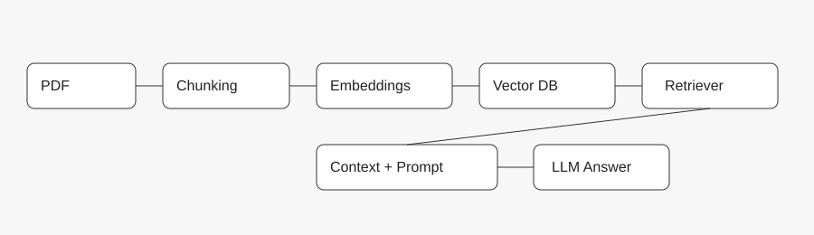

# RAG in Simple Words (Full Guide)

## STEP 1 — PRE-CONTEXT (Understand the situation)

- Audience: beginners, students, and early engineers.
- Topic depth: concept-level, but complete.
- Desired outcome: readers clearly understand RAG and can explain it.
- Tone: warm, senior-engineer clarity, no fluff.
- Format: deep-dive explainer + tutorial flow.

## STEP 2 — THE HOOK (Start with the problem)

Imagine you build a chatbot for your university. A student asks, "What is the semester fee?" The model answers confidently and still gets it wrong.

This is not because the model is bad. It is because the model does not know your university data. It only knows generic internet data.

So the real question is not "how do we use LLMs," but "how do we make LLMs answer using our data instead of guessing?"

That is where RAG comes in.

## STEP 3 — WHAT RAG IS (Concept, not definition)

RAG stands for Retrieval-Augmented Generation.

In simple words: the model looks things up first, then answers.

- Retrieve first.
- Generate after.

Think of a student in an open-book exam. The student finds the right page, then answers. That is RAG.

## STEP 4 — WHY RAG EXISTS (The real reason)

RAG exists because LLMs have three big limits:

1. They do not know your private data.
2. They are not always up to date.
3. They can hallucinate and sound correct while being wrong.

RAG fixes this by grounding the answer in real data at the time of the question.

## STEP 5 — THE CORE IDEA (Retrieval before generation)

The entire idea of RAG is one sentence:

Retrieve first, then generate.

If retrieval is bad, the answer is bad. If retrieval is good, even a small model can give a great answer.

## STEP 6 — RAG PIPELINE (End-to-end story)

**Image 1: RAG pipeline**

Here is the full pipeline in simple steps:

1. **Ingestion**: collect documents (PDFs, docs, web pages).
2. **Chunking**: split into small pieces.
3. **Embeddings**: convert each chunk into vectors.
4. **Vector database**: store vectors for fast search.
5. **Query embedding**: convert user question into a vector.
6. **Retrieval**: fetch the most similar chunks.
7. **Context injection**: add the chunks to the prompt.
8. **LLM generation**: produce the final answer.

## STEP 7 — RETRIEVAL (The heart of RAG)

Retrieval is the most important part. There are two common types:

### Dense retrieval (embeddings)

- Converts text into vectors.
- Captures meaning, not just keywords.
- "car" and "automobile" are close in vector space.

### Sparse retrieval (keyword search)

- Looks for exact words.
- Great when precision matters.
- Good for legal codes, product SKUs, exact phrases.

### Hybrid retrieval (best of both)

Most real systems combine dense and sparse retrieval to improve accuracy.

## STEP 8 — CHUNKING (Why size matters)

Chunking controls what the retriever sees.

- If chunks are too big, retrieval is noisy.
- If chunks are too small, context is broken.
- Overlap helps keep meaning across boundaries.

## STEP 9 — VECTOR DATABASE (Why it is needed)

A vector database stores embeddings and makes similarity search fast.

Without a vector database, searching every vector would be too slow at scale.

## STEP 10 — RAG VS FINE-TUNING (Simple comparison)

- **RAG**: uses external data at query time.
- **Fine-tuning**: changes the model weights.

RAG is best for facts and changing data. Fine-tuning is best for style and format.

## STEP 11 — SIMPLE VS COMPLEX RAG (Question types)

### Simple RAG

One step retrieval. One answer.

Example: "What are your business hours?"

### Complex RAG

Multi-hop retrieval. Answers come from multiple documents.

Example: "How do recent policy changes affect remote work rules?"

## STEP 12 — WHAT BREAKS IN REAL LIFE (Practical failures)

- Bad chunking returns irrelevant context.
- Weak embeddings hurt similarity matching.
- Too many chunks overwhelm the model.
- Wrong retrieval creates confident but wrong answers.

The hard part is not the LLM. The hard part is retrieval quality.

## STEP 13 — SHORT SUMMARY (One-line version)

RAG is a system design pattern where we retrieve relevant information from external data sources and use it as context for an LLM to generate grounded answers.

## STEP 14 — FINAL CLOSING

RAG is a shift in thinking. We stop treating the model as a source of truth and start using it as a reasoning engine on top of real data.

That is why RAG is the most practical way to build accurate LLM systems today.
